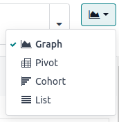

==================
Win/Loss reporting
==================

A key performance indicator available on the *Pipeline Analysis* page of the *CRM* app is the
Win/Loss ratio. 

The Win/Loss ratio is a metric of the leads/opportunities marked Won or Lost over a period of
time. By calculating "opportunities won" over "opportunities lost," teams can identify what methods
and/or individuals are effectively converting leads into sales.

.. math::
   \begin{equation}
   Win/Loss Ratio = \frac{Opportunities Won}{Opportunities Lost}
   \end{equation}

A Win/Loss report can be customized to fit a number different needs. To customize a Win/Loss report,
navigate to *Pipeline Analysis* page, by going to :menuselection:`CRM app --> Reporting -->
Pipeline`, and personalizing the data to fit any specific criteria desired.

.. example::
   A sales manager might group wins and losses by salesperson, or sales team, to see who has the
   best conversion rate. Or, a marketing team might group by sources, or medium, to determine where
   their advertising has been most successful.

.. seealso::
   - :doc:`../acquire_leads/convert`
   - :doc:`../acquire_leads/send_quotes`
   - :doc:`../pipeline/lost_opportunities`

Create win/loss reports
=======================

A basic win/loss report filters **the leads/opportunities from the past year, whether won or
lost, and groups the results by their stage in the CRM pipeline**. Displaying this in the
*Pipeline Analysis* requires a custom filter and the :guilabel:`Stage` grouping to create the
following search criteria:

.. image:: win_loss/search-criteria-for-basic-win-loss.png
   :align: center
   :alt: The search criteria for win/loss reports is Created On, Stage, and Active is in true false.

Follow the steps below to create a basic win/loss report using the above criteria:

1. Navigate to :menuselection:`CRM app --> Reporting --> Pipeline`. At the *Pipeline Analysis* page,
   click on the :guilabel:`Search bar` to open a menu of filters and grouping options.

2. In drop-down menu that appears, under the :guilabel:`Group By` heading, click :guilabel:`Stage`.
   Under the :guilabel:`Filters` heading, click :guilabel:`Add Custom Filter`.
3. When the :guilabel:`Add Custom Filter` option is clicked, a :guilabel:`Add Custom Filter` pop-up
window appears. From this pop-up window, click on the first field in the :guilabel:`Match any of the
following rules:` section. By default, the option for :guilabel:`Country` is selected.

Clicking that first field reveals a sub-menu with numerous options to choose from. From this
sub-menu, locate and select the :guilabel:`Active` option. By doing so, the other fields become
auto-populated.

The first field reads: :guilabel:`Active`. The second field reads: :guilabel:`is`. And lastly, the
third field reads: :guilabel:`set`. In total, the rule reads: :guilabel:`Active is set`.
4. Click :guilabel:`New Rule`, and once more change the default filter to :guilabel:`Active`. Click
   on the last part of this rule and change it to read "`Active` `is` `not set`."
5. Click :guilabel:`Add`.

.. image:: win_loss/add-custom-active-filter.png
   :align: center
   :alt: The Add Custom Filter menu showing two rules: (1) Active is set, and (2) Active is not set.

Click off the *Search* menu to reveal the report, which now displays the total :guilabel:`Count` of
leads, whether won or lost, grouped by their stage in the CRM pipeline. Hover over a section of the
report to see the number of leads in that stage.

Advanced filters and groupings
------------------------------

The *Pipeline Analysis* can be customized with various filters and group by options. After
creating a basic win/loss report, click on the :guilabel:`Search bar` and consider adding advanced
filters and groupings to customize the report for different purposes. Some useful options
include:

- **Created On**: Adjusting this filter to a different period of time such as the last 30 days
  or the last quarter can provide more timely results.
- **Add Custom Filter**: Clicking :guilabel:`Add Custom Filter` and scrolling through the numerous
  options in the drop-down opens up additional search criteria like :guilabel:`Last Stage Update` or
  :guilabel:`Lost Reason`.
- **Multiple Groupings**: Adding multiple *Group By* selections can split results into more
  relevant and manageable chunks.

  - Adding :guilabel:`Salesperson` or :guilabel:`Sales Team` breaks up the total count of leads in
    each :guilabel:`Stage` by who they were assigned to.
  - Adding :guilabel:`Medium` or :guilabel:`Source` can reveal what marketing avenues generate more
    sales.
- **Add Custom Group > Active**: Clicking :menuselection:`Add Custom Group --> Active` separates the
  results in each stage into *Won (true)* or *Lost (false)*. This can show at what stage leads are
  won and lost.

Additional measurements and views
---------------------------------

In addition to filters and group by options, the *Pipeline Analysis* can also display different
measurements, chart types, and :ref:`report views <reporting/views>`. Need to know something other
than the total count of leads? Change the measurement to something more valuable. Want to see the
report as a spreadsheet? Switch to the :guilabel:`Pivot View`.

To change the measurement, click the :guilabel:`Measures` button and select an option from the
drop-down such as :guilabel:`Expected Revenue`, :guilabel:`Days to Assign`, or
:guilabel:`Days to Close`.

In addition to the standard :guilabel:`Bar Chart`, the graph icons along the top of the report can
switch the visual to a :guilabel:`Line Chart` or :guilabel:`Pie Chart`. The :guilabel:`Stacked` icon
further separates the results in a :guilabel:`Bar Chart` or :guilabel:`Line Chart`.

Finally, the :ref:`four icons in the top-right <reporting/views>` provide more detailed views of the
numbers and records that make up the report. Instead of the default :guilabel:`Graph View`, try
clicking the :guilabel:`Pivot View` to see the report in a table format, or :guilabel:`List View`
to see a single list of every record in the report.

Win/Loss in pivot view
======================

After creating a basic win/loss report in the *CRM app's Pipeline Analysis*, consider
:ref:`selecting Pivot View <reporting/views>` to see the data in a table format. By default,
:guilabel:`Pivot View` groups basic win/loss reports by :guilabel:`Stage` and measures
:guilabel:`Expected Revenue` instead of the :guilabel:`Count` of leads.

To flesh out the table, remove the :guilabel:`Stage` grouping from the *Search bar* and replace it
with something like :guilabel:`Salesperson`, then click the :guilabel:`Measures` button and add the
:guilabel:`Count` of leads back into the report.

.. tip::
   In the *Search* menu, selecting :menuselection:`Add Custom Group --> Active` splits the leads in
   each row into *Won (Yes)* and *Lost (No)*. This selection makes it easy to calculate win/loss
   ratios at a glance.

Save a pivot view report as a spreadsheet
-----------------------------------------

Saving a win/loss report creates a copy that automatically updates, so it does not need to be run
again manually. One option for this is inserting the report into a spreadsheet where additional
charts and formulas can be added to expand the report even more.

To add a report in :guilabel:`Pivot View` to a spreadsheet, click the
:guilabel:`Insert in Spreadsheet` button.

.. important::
   If the :guilabel:`Insert In Spreadsheet` button is greyed out and hovering over it produces an
   error message saying: *Pivot contains duplicate groupbys*, remove the :guilabel:`Stage` grouping
   from the Search bar and replace it with something like :guilabel:`Salesperson`.

In the pop-up menu, click :guilabel:`Confirm`. The spreadsheet automatically opens and can be edited
with custom charts and formulas.

To view the spreadsheet in the future, navigate back to the main apps page, then go to
:menuselection:`Documents --> Spreadsheet`.

.. tip::
   After editing a spreadsheet, it can be added to the *Dashboards app* for easier viewing and
   comparing to other reports. In the spreadsheet, open the :guilabel:`File` menu, and select
   :guilabel:`Add to dashboard`.

Win/Loss in list view
=====================

Similar to :guilabel:`Pivot View`, :ref:`selecting List View <reporting/views>` in the *CRM app's
Pipeline Analysis* can make a basic win/loss report more useful in a number of ways. All leads are
displayed on a single page, and clicking on a lead opens the *Sales Quotation* page for the account.

.. image:: win_loss/win-loss-list-view.png
   :align: center
   :alt: A win/loss report in List View displays all leads in an easy-to-read list.

In :guilabel:`List View`, try opening the *Search* menu and adding more *Group By* options such as:

- **Medium**: Adding this option shows the marketing medium (Banner, Direct, Email, Google
  Adwords, Phone, Website, etc.) that originated each lead.
- **Country**: Adding this option in addition to :guilabel:`Medium` further divides the
  marketing results to show what country each lead originated in.

.. tip::
   The order each *Group By* option is added determines the nesting order in :guilabel:`List View`.
   To re-order the nesting, remove all *Group By* options from the *Search bar* and re-add them in
   the desired order.

Save a list view report to a spreadsheet
----------------------------------------

Saving a win/loss report creates a copy that automatically updates, so it does not need to be run
again manually. One option for this is inserting the report into a spreadsheet where additional
charts and formulas can be added to expand the report even more.

To add a report in :guilabel:`List View` to a spreadsheet, click the :guilabel:`Actions` icon (the
gear next to *Pipeline Analysis*). Hover over :guilabel:`Spreadsheet`, and click
:guilabel:`Insert list in spreadsheet`.

In the pop-up menu, click :guilabel:`Confirm`. The spreadsheet automatically opens and can be edited
with custom charts and formulas.

To view the spreadsheet in the future, navigate back to the main apps page, then go to
:menuselection:`Documents --> Spreadsheet`.

.. tip::
   After editing a spreadsheet, it can be added to *Dashboards* so it continues to update
   automatically. In the spreadsheet, open the :guilabel:`File` menu, and select
   :guilabel:`Add to dashboard`.

Add win/loss reports to Dashboards
==================================

After configuring a win/loss report in either :guilabel:`Pivot View` or :guilabel:`List View`,
adding the report to the *Dashboards app* saves it for easier viewing in the future. Additionally, a
saved win/loss report automatically updates, so it does not need to be run again manually.

To add a win/loss report to the *Dashboards app*, open the report in either :guilabel:`Pivot View`
or :guilabel:`List View`, and click the :guilabel:`Actions` icon (the gear next to *Pipeline
Analysis*). Hover over :guilabel:`Dashboard`, type a name for the report, and click :guilabel:`Add`.

.. image:: win_loss/add-to-dashboard.png
   :align: center
   :alt: In the Pipeline Analysis, click the gear icon, hover over Dashboard, and click Add.

To view the report, navigate back to the main apps page, then go to
:menuselection:`Dashboards --> My Dashboard`. The report is displayed alongside the rest of the
dashboard.

